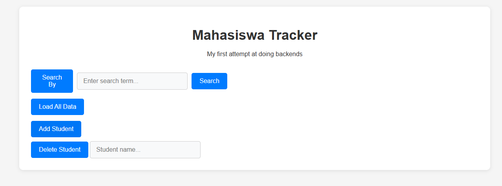

## 🛠️ API Try — My First Fullstack CRUD App
Welcome to API Try, a simple CRUD web app where I experimented with backend development for the first time using FastAPI and SQLAlchemy. What started as a backend learning project turned into a fullstack challenge, where I surprisingly ended up spending way more time on the frontend 😅.

## 🚀 Features
- Create, Read, Update, and Delete (CRUD) entries from a local SQLite database

- Backend built with FastAPI, powered by Uvicorn for development

- Uses SQLAlchemy ORM and SQLite for lightweight data persistence

- Frontend built from scratch with HTML, vanilla CSS, and vanilla JavaScript

## 🧰 Tech Stack
- FastAPI
- Uvicorn
- SQLAlchemy
- SQLite

## 📸 Screenshots
- "Homepage"

- Load All Data

## 💡 Lessons Learned
This project taught me:
- The basics of RESTful API design with FastAPI
- How ORMs like SQLAlchemy work under the hood
- How to handle dynamic frontend interactions using Fetch API
- That frontend work can unexpectedly suck you in 😄